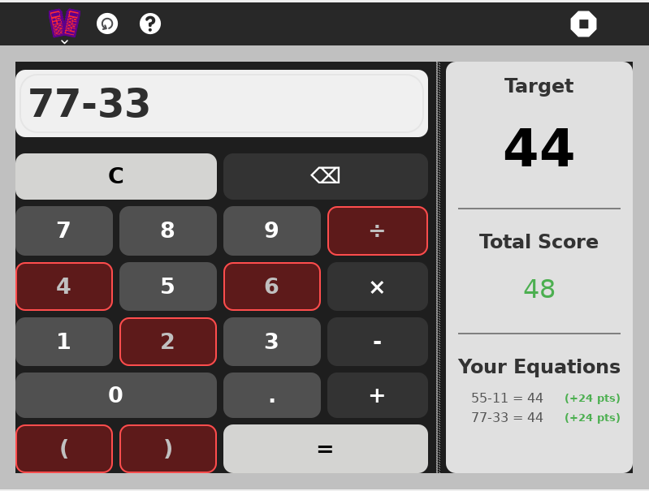

# Broken-Calculator


## Overview

Broken-Calculator is an engaging puzzle game inspired by the Broken Calculator challenge. Players are tasked with creating five unique equations that all equal a given target number using basic arithmetic operations. This game combines creativity with mathematical thinking to build fluency in fundamental math operations.


## 🎮 How to Play

1. **Target Number**: You'll be given a target number to reach
2. **Create Equations**: Build five different equations using addition (+), subtraction (-), multiplication (×), and division (÷)
3. **Get Creative**: Each equation must be unique and equal the target number
4. **Earn Points**: Valid equations earn you points based on complexity and creativity



## How to Use

For a step-by-step walkthrough, see the official documentation on installing activities:

[How to Install Activities – Sugar Labs Wiki](https://wiki.sugarlabs.org/go/How_to_install_activities)

Alternatively, for development or testing purposes, you may clone or copy the activity directory into your `~/Activities` folder and then restart Sugar to have it appear in the activity ring:

```bash
git clone <repository-url> ~/Activities/<activity-name>

cp -r /path/to/local/activity ~/Activities/
```